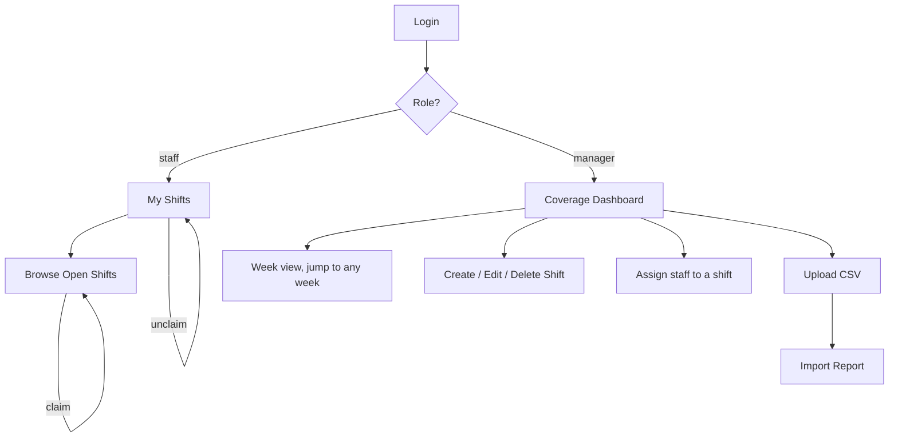
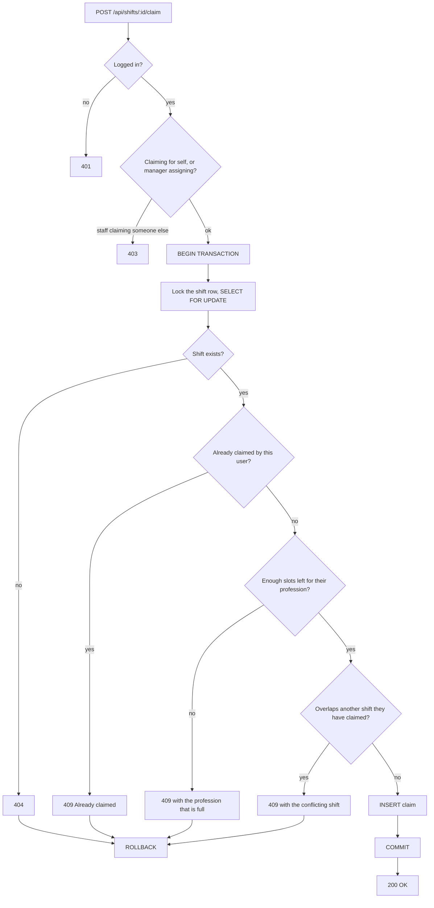
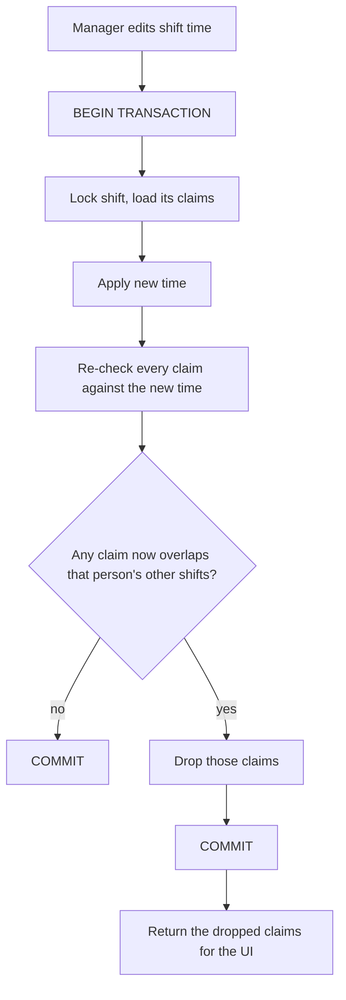
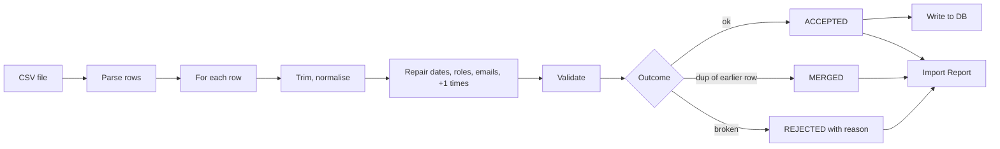
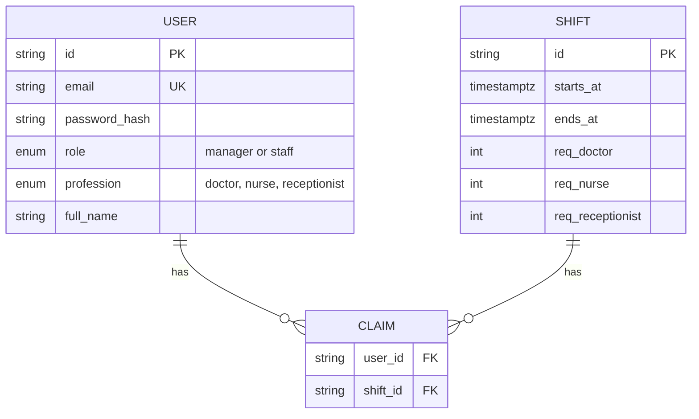

# Flows

## 1. Screens



| Screen | Who |
|---|---|
| Login | everyone |
| Browse open shifts, claim | staff |
| My shifts, unclaim | staff |
| Coverage dashboard | manager |
| Shift create / edit form | manager |
| CSV upload | manager |
| Import report | manager |

Manager routes check the role on the server, not only by hiding links.

## 2. Claim a shift

One transaction. The shift row is locked before anything is counted.



Overlap test:

```
A.starts_at < B.ends_at AND B.starts_at < A.ends_at
```

Staff claiming and manager assigning call the same function.

## 3. Edit a shift



If requirements are lowered below current claims, drop the most recently added
claims for that profession.

## 4. Import

Seed and UI upload call the same function. The header is validated before any
row is parsed.



```ts
type RowOutcome =
  | { status: 'accepted'; row: RawRow; data: Shift | Staff }
  | { status: 'merged';   row: RawRow; mergedInto: string; reason: string }
  | { status: 'rejected'; row: RawRow; reason: string }
```

## 5. Data model



Database constraints: `UNIQUE(user_id, shift_id)`, `UNIQUE(email)`,
`CHECK (ends_at > starts_at)`.

Profession capacity and per-user overlap cannot be constraints, so they are
enforced in the transaction shown in flow 2.
